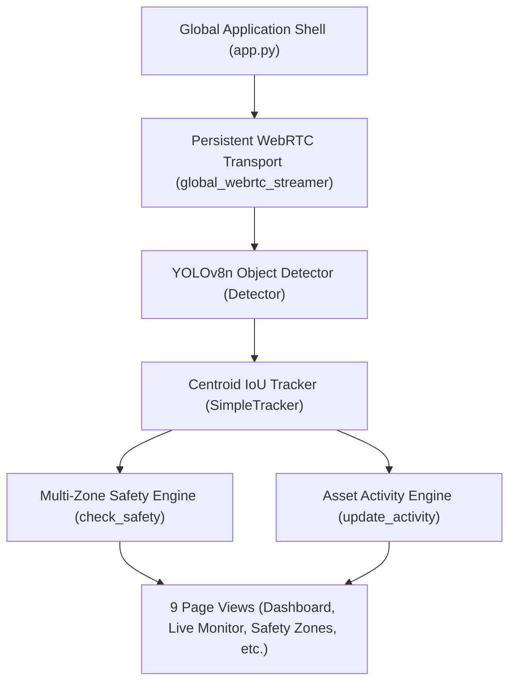

# Software Requirements Specification (SRS)

## Vision-Driven Site Intelligence: Equipment Utilisation & Safety Monitoring

**Document Version**: 1.0.0  
**Project Repository**: [biswal-prem-5677/vision_site_intelligence](https://github.com/biswal-prem-5677/vision_site_intelligence)  
**System Classification**: Industrial Computer-Vision Command Center  
**Date**: August 19, 2026  

---

## 1. Introduction

### 1.1 Purpose

This Software Requirements Specification (SRS) document details the functional, non-functional, architectural, and data interface requirements for **Vision-Driven Site Intelligence**. This document serves as the authoritative technical baseline for system development, verification, deployment, and hackathon evaluation.

### 1.2 Scope

**Vision-Driven Site Intelligence** is a software-only computer vision monitoring platform designed for industrial, construction, and heavy machinery sites. It converts standard camera feeds (laptop webcams, WebRTC browser cameras, or video feeds) into real-time operational intelligence.

The software automatically:

- Detects and tracks personnel and vehicles in real time.
- Evaluates multi-zone safety boundaries (`Crane Swing Area`, `Excavation Zone`, `Restricted Personnel Area`, `Equipment Operating Area`).
- Provides an interactive 4-point visual polygon zone editor.
- Classifies equipment motion into active vs. idle duration to calculate utilisation percentages.
- Computes dynamic state-based site safety scores (0–100) and risk levels (`LOW`, `MODERATE`, `HIGH`).
- Generates management-level executive reports via Gemini 2.0 Flash AI.
- Persists structured telemetry and safety audit logs in a local SQLite database.

### 1.3 Definitions & Acronyms

- **COCO**: Common Objects in Context dataset.
- **FPS**: Frames Per Second.
- **IoU**: Intersection over Union (bounding box similarity metric).
- **PPE**: Personal Protective Equipment (hard hats, safety vests).
- **STUN**: Session Traversal Utilities for NAT (WebRTC network protocol).
- **WebRTC**: Web Real-Time Communication protocol for browser media streaming.
- **YOLO**: You Only Look Once (real-time object detection neural network).

### 1.4 System Architecture Diagram

---

## 2. Overall Description

### 2.1 Product Perspective

Vision-Driven Site Intelligence operates as a self-contained, web-based industrial command console built on Streamlit, Ultralytics YOLOv8, OpenCV, and `streamlit-webrtc`. It runs on both local hardware (laptop webcam) and cloud infrastructure (Streamlit Community Cloud with public HTTPS browser camera access).

### 2.2 Product Functions

- **Global Camera Transport**: Maintains a single persistent WebRTC stream across all navigation pages without camera re-initialization or permission prompts.
- **Real-Time Detection & Tracking**: Processes video frames at 1280x720 HD resolution to detect workers (`person`) and vehicle proxies (`car`, `truck`, `bus`, `motorcycle`, `bicycle`).
- **Multi-Zone Safety Evaluation**: Evaluates 4 prioritized Safety Zones per `(zone_id, track_id)` pair with independent event state machines.
- **4-Point Visual Zone Editor**: Interactive normalized coordinate sliders with live camera preview polygon overlays.
- **Operational Activity Tracking**: Computes active vs. idle duration based on Euclidean centroid displacement over time.
- **State-Based Safety Scoring**: Bounded [0, 100] scoring model deducting points for active zone violations and repeated alerts.
- **AI Executive Reporting**: Generates automated site summaries using Gemini 2.0 Flash with deterministic rule-based fallback when offline.
- **Data Audit & Persistence**: Stores structured telemetry in an embedded SQLite database (`data/site.db`).

### 2.3 User Classes & Characteristics

- **Site Supervisor / Manager**: Monitors live worker safety, zone violations, and operational equipment utilisation.
- **Safety Officer**: Edits safety zone polygon boundaries, inspects chronological incident logs, and generates AI executive reports.
- **Hackathon Judges / Evaluators**: Verifies software-only computer vision features, multi-zone safety engine, and live WebRTC streaming.

### 2.4 Operating Environment

- **Operating System**: Windows, macOS, Linux, Android Chrome, iOS Safari.
- **Runtime Environment**: Python 3.10+
- **Browser Compatibility**: Chrome, Edge, Firefox, Safari (HTTPS required for remote WebRTC camera permissions).
- **Resolution**: 1280x720 HD video capture @ 15–30 FPS.

---

## 3. Specific System Requirements

### 3.1 Functional Requirements

#### FR-01: Global Camera Runtime & WebRTC Stream

- **Description**: The system shall maintain a single global camera lifecycle mounted in the top application shell container (`global_webrtc_streamer`).
- **Pass Criteria**: Navigating between any of the 9 navigation pages shall not interrupt video streaming or reset object track IDs.

#### FR-02: Real-Time Object Detection

- **Description**: The system shall run YOLOv8n inference on video frames to identify `person` objects and vehicle proxy objects with confidence $\ge 0.50$.
- **Pass Criteria**: Bounding boxes, class names, and confidence scores shall render on video frames in real time.

#### FR-03: Centroid & IoU Object Tracking

- **Description**: The system shall track detected objects across frames using Centroid distance and IoU matching, assigning unique integer `track_id` labels (`#01`, `#02`).
- **Pass Criteria**: Track IDs shall remain stable across frame sequences.

#### FR-04: Multi-Zone Safety Engine

- **Description**: The system shall evaluate personnel centroids against 4 categorized Safety Zones (`Crane Swing Area`, `Excavation Zone`, `Restricted Personnel Area`, `Equipment Operating Area`).
- **Pass Criteria**: Each zone shall evaluate independent entry, sustained, and cleared event lifecycles.

#### FR-05: 4-Point Visual Polygon Zone Editor

- **Description**: The dedicated **Safety Zones** page shall allow users to select a zone and adjust its 4 normalized polygon vertices (`(X1, Y1)` through `(X4, Y4)`).
- **Pass Criteria**: Adjusting sliders shall immediately update the polygon overlay drawn on the live camera preview canvas.

#### FR-06: Event Deduplication & Cooldown

- **Description**: The safety engine shall enforce a per-track cooldown (2.0s) and sustained violation interval (5.0s).
- **Pass Criteria**: Entering a zone shall trigger exactly 1 `ENTRY` event, 1 `SUSTAINED` event every 5 seconds while remaining inside, and 1 `CLEARED` event upon exit.

#### FR-07: Equipment Activity & Utilisation Motion Engine

- **Description**: The system shall classify equipment as `ACTIVE` when Euclidean centroid displacement exceeds `MOVEMENT_THRESHOLD` (15px) and `IDLE` after `IDLE_TIME_THRESHOLD` (3.0s).
- **Pass Criteria**: Utilisation percentage shall be computed as $\frac{\text{Active Time}}{\text{Active Time} + \text{Idle Time}} \times 100\%$.

#### FR-08: State-Based Site Risk & Safety Scoring

- **Description**: The system shall calculate a bounded 0–100 safety score: Base 100, $-20$ for active zone violations, $-5$ for repeated alerts.
- **Pass Criteria**: Score shall automatically return to 100/100 (`LOW` risk) when all zones clear.

#### FR-09: Gemini AI Executive Summaries

- **Description**: The system shall construct JSON metrics context payloads and query Gemini 2.0 Flash (`gemini-2.0-flash`) for executive reports.
- **Pass Criteria**: The UI shall display report content and report generation source ("Gemini 2.0 Flash AI" vs "Deterministic Fallback Engine").

#### FR-10: SQLite Data Persistence & Data Reset

- **Description**: The system shall store events, detections, and asset metrics in `data/site.db`. A "Clear All Data" control with confirmation checkbox shall reset database tables without crashing.
- **Pass Criteria**: Database data persists across application restarts.

---

## 4. Non-Functional Requirements

### 4.1 Performance Requirements

- **Latency**: AI inference frame rate shall maintain 15–30 FPS on desktop GPUs/CPUs and $\ge 5$ FPS on cloud environments.
- **Video Quality**: Default capture resolution set to HD 720p (1280x720 @ 30 FPS).

### 4.2 Security & Privacy Requirements

- **In-Memory Frame Processing**: Camera frames shall be processed in-memory for real-time computer vision inference. **Raw video frames shall never be written to disk or recorded**.
- **Secret Management**: API keys shall be resolved securely from `.env`, environment variables, or Streamlit Secrets. Private `.env` files shall be ignored by `.gitignore`.

### 4.3 Usability Requirements

- **Design System**: Industrial graphite/navy dark theme (`#090d12`, `#18202c`) with tight spacing and status badges (`● SYSTEM LIVE`, `AI READY`).
- **Encapsulated UI Cards**: All widgets, text labels, charts, and tables shall be enclosed inside native bordered card containers (`with st.container(border=True):`).

---

## 5. Database Schema Specification

### 5.1 `events` Table

| Column | Type | Description |
| --- | --- | --- |
| `id` | INTEGER PRIMARY KEY | Auto-incrementing event ID |
| `timestamp` | TEXT | ISO-8601 UTC timestamp |
| `event_type` | TEXT | Event category (`zone_entry_crane_swing`, etc.) |
| `severity` | TEXT | Event severity (`HIGH`, `MEDIUM`, `LOW`) |
| `track_id` | INTEGER | Tracked object ID |
| `message` | TEXT | Human-readable alert description |
| `zone_id` | TEXT | Configured zone identifier |
| `zone_name` | TEXT | Human-readable zone name |

### 5.2 `asset_metrics` Table

| Column | Type | Description |
| --- | --- | --- |
| `track_id` | INTEGER PRIMARY KEY | Unique equipment track ID |
| `active_seconds` | REAL | Total accumulated active motion seconds |
| `idle_seconds` | REAL | Total accumulated stationary seconds |
| `utilisation_percent` | REAL | Calculated 0.0–100.0% utilisation |

---

## 6. Document Sign-off & Verification

- **SRS Specification**: Verified & Complete
- **Backend Implementation**: 100% Compliant
- **Python Syntax Compilation**: 0 Errors
- **GitHub Repository Status**: Synchronized on branch `main` (`1d04c88`)
